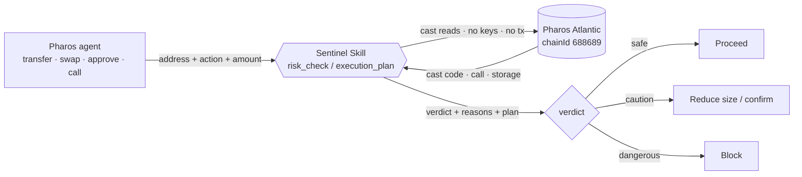
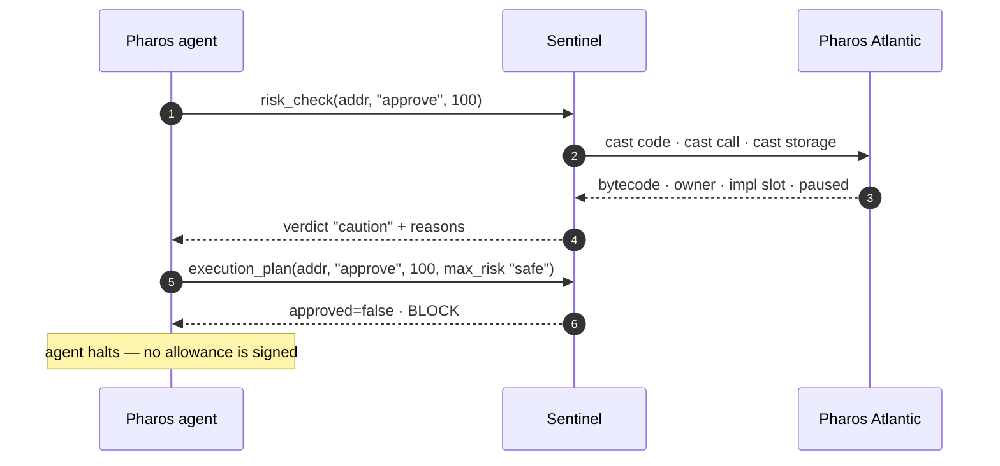
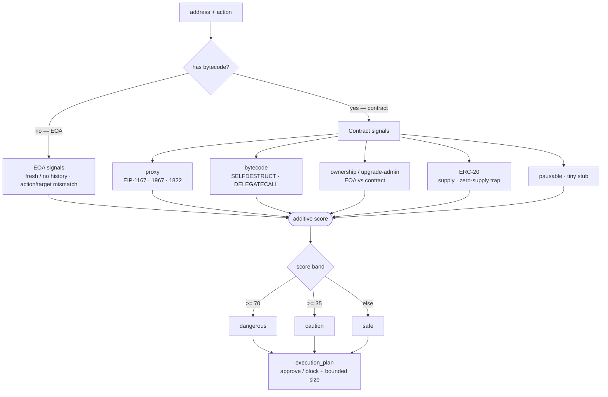

# Sentinel — a pre-action on-chain risk gate for Pharos agents

This repository ships the **Pharos Skill Engine** with **Sentinel** added as its
**Step 0 — risk pre-check**. The engine
([`PharosNetwork/pharos-skill-engine`](https://github.com/PharosNetwork/pharos-skill-engine))
gives an AI agent the full Pharos on-chain toolkit — balance/transaction queries, transfers,
contract deploy & verify, and batch airdrops — driven through Foundry (`cast` / `forge`).
**Sentinel** is the reusable Skill this repo adds on top: an agent calls it **before it moves
value** and gets a risk **verdict** (`safe` / `caution` / `dangerous`), the **reasons** behind
it, and a **risk-bounded execution plan**. It is read-only — it advises and blocks; it never
signs or sends a transaction.

A pre-action risk check is the most-called primitive in any on-chain agent stack: every
transfer, swap, or approval is a place an agent can lose funds. Sentinel makes that check a
single, composable call, and wires it in as the engine's first write-operation pre-check.

## What's in this package

This is the Pharos Skill Engine layout, with Sentinel slotted in as a skill:

- **`SKILL.md`** — the engine's agent entry point. Sentinel is registered in the Capability
  Index and as **Step 0** of the Write-Operation Pre-checks.
- **`references/`** — the engine's command references (`query.md`, `transaction.md`,
  `contract.md`, `script-gen.md`) plus **`sentinel.md`**, the risk-gate reference.
- **`assets/`** — the engine's `networks.json` (Atlantic testnet + mainnet), `tokens.json`,
  ERC-20 / airdrop Solidity templates, and script-generation templates.
- **Sentinel runtime** — `sentinel_skill.py` (MCP server), `sentinel_cli.py` (CLI),
  `pharos_atlantic.py` (RPC reads), plus the demos, live risk gallery, x402 gate, and tests.

Sentinel runs on **Atlantic testnet** — matching the engine's default network and its Piggy Bank
reference skill — while mainnet stays available in `networks.json` for the engine's other
capabilities.

## What makes it different

- **Read-only by design.** Sentinel never holds keys and never sends a transaction — the safest
  possible posture for a Skill that agents trust before moving money.
- **Foundry-native execution.** Every on-chain read runs through the Foundry `cast` CLI — the same
  toolchain the rest of the Skill Engine uses — so Sentinel composes into the engine rather than
  bolting a separate client onto it. No indexer, no third-party API, no keys, no database.
- **Not just a verdict — a plan.** `execution_plan` returns approve/block plus bounded sizing
  within the caller's risk tolerance, so the agent gets a decision, not just a score.
- **Real EVM depth.** Bytecode opcode analysis and proxy/ownership introspection, not surface
  heuristics (details below).

## How it works

Sentinel sits between an agent and the chain. The agent declares an intent; Sentinel reads
Pharos Atlantic by executing read-only Foundry `cast` commands (no keys, no transaction), scores
what it finds, and returns a verdict, the reasons, and a risk-gated plan. The agent acts on the plan.



A blocked `approve` under a strict safe-only tolerance, end to end (mirrors `demo_agent.py`):



## Two tools

| Tool | Purpose |
|------|---------|
| `risk_check(address, action, amount_phrs?)` | Returns `{verdict, score, reasons[], data{}}`. |
| `execution_plan(address, action, amount_phrs, max_risk)` | Risk-gated: approve/block + bounded sizing within tolerance. |

`action` is one of `transfer` \| `swap` \| `approve` \| `call`.

## Risk signals (v2 — read via Foundry `cast`)

- **Contract vs EOA**, and action/target mismatches (e.g. `approve` to a non-token, or to a wallet).
- **Proxy detection:** EIP-1167 minimal proxies and EIP-1967/1822 **upgradeable** proxies
  (the owner can swap the logic after you interact — a real rug vector).
- **Bytecode opcode analysis:** a proper opcode walk (stepping over PUSH immediates) that flags
  **SELFDESTRUCT** and **DELEGATECALL** used outside a known proxy pattern.
- **Ownership & upgrade-admin concentration:** `owner()` + the EIP-1967 admin slot, distinguishing
  an **EOA owner** (higher centralization risk) from a contract owner (likely multisig/timelock).
- **ERC-20 introspection:** `symbol` / `decimals` / `totalSupply`, with a zero-supply-trap flag.
- **Pausable state** (`paused()`), **tiny-bytecode stubs**, and brand-new / zero-history
  counterparties (a typo & address-poisoning guard).

The score is additive, so signals stack; the verdict is a band over it
(`>=70` dangerous, `>=35` caution, else safe). Every signal feeds one additive score, which a
band turns into the verdict and `execution_plan` turns into a decision:



## Use it two ways

**As an MCP server** — for MCP-capable agents:
```bash
pip install -r requirements.txt
python sentinel_skill.py          # stdio MCP server exposing risk_check + execution_plan
```

**As a framework Skill (SKILL.md) / CLI** — for Claude Code / OpenClaw / Codex style agents:
```bash
python sentinel_cli.py <address> <action>                    # verdict (JSON)
python sentinel_cli.py <address> approve --plan --max-risk safe   # risk-gated plan
```
The CLI exits `0` for safe/caution (or an approved plan) and `2` for dangerous/blocked, so a
shell or agent can branch on the exit status alone. See `SKILL.md` for the skill definition.

## Quickstart

Live reads require **Foundry** (`cast`) on your PATH (`curl -L https://foundry.paradigm.xyz | bash && foundryup`).
The offline tests and the `--synthetic` tour need neither Foundry nor network.

```bash
python -m unittest test_sentinel   # 34 deterministic offline tests (no network, no Foundry)
python feature_tour.py --synthetic # walk every signal instantly (no network)
python demo_agent.py               # an agent drives the Skill over MCP against live Atlantic
python -c "import pharos_atlantic as p; print('chain_ok:', p.chain_ok())"
```

## Sample output

```text
$ python sentinel_cli.py 0x24f3cd306c85903ca2ccd0ee8dc1c74111151b23 call
{
  "verdict": "caution",
  "score": 35,
  "reasons": ["tiny bytecode (1 bytes) — likely a stub/trap rather than a working contract"],
  "data": { "is_contract": true, "code_size": 1 }
}
```

## Live demo

Drive five Sentinel features as five real Atlantic transactions, one command each:

```bash
python demo.py deploy      # deploy a malicious contract -> Sentinel flags it DANGEROUS
python demo.py upgrade     # swap a proxy's logic in one tx -> verdict escalates
python demo.py pause       # pause a contract -> verdict escalates
python demo.py transfer    # execution_plan sends real PHRS only when safe
python demo.py x402        # pay-per-query risk check over x402
python demo.py all         # all five, with a transaction summary
```

Every run deploys fresh contracts and sends fresh transactions — it's live, not a recording. Full
runbook (commands, suggested patter, expected output) in [`DEMO.md`](DEMO.md).

## Live on Pharos Atlantic

Sentinel integrates with **Pharos Atlantic Testnet** via live Foundry `cast` reads:

- RPC `https://atlantic.dplabs-internal.com` · chainId **688689** · explorer
  `https://atlantic.pharosscan.xyz` · gas token **PHRS**

### Live risk gallery

To prove the engine against real bytecode (not mocks), a spectrum of decoy contracts was
**deployed on Atlantic**, each engineered to trip a different signal. Sentinel reads them live and
returns a monotonic safe → caution → dangerous ladder — reproduce it yourself with `python gallery.py`:

| Exhibit | Action | Verdict | Score | Signal demonstrated |
|---|---|:--:|--:|---|
| [CleanToken](https://atlantic.pharosscan.xyz/address/0x63079724981B42967ee9F77E637767ac7779e181) | transfer | 🟢 safe | 0 | clean ERC-20, no privileged owner — baseline, no false alarm |
| [MinimalProxy](https://atlantic.pharosscan.xyz/address/0x434d20f7211deaca55667d313b9e6035481ef6f5) | call | 🟢 safe | 10 | EIP-1167 minimal proxy detected |
| [TinyStub](https://atlantic.pharosscan.xyz/address/0x24f3cd306c85903ca2ccd0ee8dc1c74111151b23) | call | 🟡 caution | 35 | tiny-bytecode stub / trap |
| [ZeroSupplyToken](https://atlantic.pharosscan.xyz/address/0x59A0cb6350D93714e557Ea0ddC2e60d1aD558dc5) | transfer | 🟡 caution | 40 | zero-supply token trap + EOA owner |
| [UpgradeableProxy](https://atlantic.pharosscan.xyz/address/0xE7797e15DEb86931d7F7b940684Ed1edc5cC7513) | call | 🟡 caution | 50 | EIP-1967 upgradeable + EOA owner + paused |
| [Backdoor](https://atlantic.pharosscan.xyz/address/0x75fb8b091A7A88bAF14F23Eac2F33962A4Cdd35D) | call | 🔴 dangerous | 70 | SELFDESTRUCT + unguarded DELEGATECALL + paused |

Each verdict above is produced live, on-chain. The address/verdict map lives in
[`fixtures.json`](fixtures.json); `gallery.py` re-checks every exhibit and fails on any drift. The
Solidity-backed exhibits (CleanToken, ZeroSupplyToken, UpgradeableProxy, Backdoor) have **verified
source on Pharos Scan** — open any address and check the Contract tab; sources are in
[`fixtures/`](fixtures/).

### Live upgrade attack — Sentinel catches a rug as it happens

The gallery above is static. To prove Sentinel reads **live, mutable** state — and to demonstrate
the exact threat it warns about — a mutable EIP-1967 proxy was deployed pointing at benign logic,
then **upgraded on-chain to hostile logic in a single transaction**. Sentinel read the *same proxy
address* before and after:

| | Implementation | Verdict | What Sentinel sees |
|---|---|:--:|---|
| **Before** | benign logic | 🟢 safe (20) | upgradeable — *owner can swap the logic after you interact* |
| **After** ([upgrade tx](https://atlantic.pharosscan.xyz/tx/0xc7e58da048465c0ecefbf5bc52f5a16ec0b828f529b2f379aa9fb562076cebc0)) | hostile logic | 🟡 caution (50) | + an EOA owner now holds privileged control + the contract is now PAUSED |

The proxy address never changed —
[`0x22Aa…d27A`](https://atlantic.pharosscan.xyz/address/0x22Aa40e24a1186131C2Ea21db191095eD590d27A) —
but its implementation, ownership, and pause state did. That is the upgrade-rug vector demonstrated
end to end: because Sentinel reads on-chain state at call time, its verdict reflects the swap the
moment it lands. The warning it prints *before* an attack is the risk that *becomes* the attack.

### Live pause flip — Sentinel tracks operational state

A second live mutation, on a plain (non-proxy) contract. It carries a latent `SELFDESTRUCT`
(25 — below the caution line on its own); the operator then **pauses it in a single transaction**,
and Sentinel, reading state at call time, tips to caution:

| | `paused()` | Verdict | What Sentinel sees |
|---|:--:|:--:|---|
| **Before** | — | 🟢 safe (25) | latent SELFDESTRUCT |
| **After** ([pause tx](https://atlantic.pharosscan.xyz/tx/0x97cad956c6242317be9ef8129a78e4335797014f72ff2e9499862c667bb88734)) | true | 🟡 caution (45) | + the contract is now PAUSED |

Same contract — [`0xE84f…410B`](https://atlantic.pharosscan.xyz/address/0xE84f51f6D4146bC3c676A190B8988EA9B2Db410B) —
different live state, different verdict.

### The gate moves real value

`execution_plan` is not advisory theatre — it decides whether value actually moves.
[`guarded_transfer.py`](guarded_transfer.py) asks Sentinel, then **sends a real PHRS transfer only
when the plan is approved**:

- ✅ vetted counterparty → `safe` → approved → [0.0005 PHRS sent](https://atlantic.pharosscan.xyz/tx/0x1d9979cb19c75f4385f984da5b0f68cb89d0993b9f511d0a9cc3ce198a12332a)
- ⛔ the live `Backdoor` fixture → `dangerous` → blocked → **no transaction is signed**

The Skill stays read-only; only the agent signs. One approval moved value on-chain; one block
stopped it before a transaction existed.

## Paid calls via x402

Pharos lists *"pay-per-query supplier / supply-chain risk assessment"* as a flagship x402
use case — which is exactly what Sentinel is. So `risk_check` is also exposed behind an
**x402 paywall**: an unpaid request gets `402 Payment Required`; the agent pays a micro-transfer
on Atlantic; the retry returns the verdict plus the settlement `tx_hash`.

```bash
python sentinel_x402.py   # read-only x402 gate on 127.0.0.1:4021
python x402_demo.py       # 402 -> pay on Atlantic -> 200 verdict -> replay rejected
```

The gate verifies payment with the **same Foundry `cast` reads Sentinel uses for risk**, so the
server stays read-only and keyless (only the client sends value) and adds **no new dependencies**
beyond Foundry + the Python stdlib. Full design and the official `@x402` SDK path: [`X402.md`](X402.md).

## Security posture

The Skill is intentionally minimal and auditable. It executes only **read-only Foundry `cast`
commands** (`cast code` / `call` / `storage` / `balance` / `nonce` / `chain-id`, plus `cast rpc`
for tx/receipt lookups) against a single Pharos RPC endpoint — the same execution model the rest
of the Skill Engine uses. It **holds no private key, never signs or sends a transaction, makes no
filesystem writes, and reads no secrets or environment** beyond the RPC URL.

## Files

| File | Role |
|------|------|
| `sentinel_skill.py` | MCP server — tools `risk_check`, `execution_plan` |
| `pharos_atlantic.py` | Pharos Atlantic config + read-only Foundry `cast` read/introspection helpers |
| `sentinel_cli.py` | Thin CLI wrapper for SKILL.md / framework agents |
| `SKILL.md` | Skill definition for Claude Code / OpenClaw / Codex |
| `demo.py` | Live demo driver — one subcommand per on-chain feature (deploy/upgrade/pause/transfer/x402) |
| `DEMO.md` | Live demo runbook — commands, suggested patter, expected output |
| `demo_agent.py` | Demo agent driving the Skill over a real MCP connection against live Atlantic |
| `guarded_transfer.py` | Agent that sends a real PHRS transfer only when `execution_plan` approves |
| `feature_tour.py` | Guided walkthrough of every risk signal |
| `gallery.py` | Re-checks the live Atlantic risk-gallery fixtures and flags drift |
| `fixtures.json` | Deployed gallery addresses + expected verdicts |
| `sentinel_x402.py` | x402 paid-call gate — `risk_check` behind HTTP 402 (read-only verify) |
| `x402_demo.py` | Drives the full x402 pay-per-query loop on live Atlantic |
| `X402.md` | x402 design: native verify-by-RPC + the official `@x402` SDK path |
| `references/sentinel.md` | Sentinel's engine reference file — risk gate + Foundry (`cast`) read equivalents |
| `references/{query,transaction,contract,script-gen}.md` | Pharos Skill Engine command references (queries, transactions, contracts, script-gen) |
| `assets/networks.json` | Pharos network config (Atlantic testnet + mainnet) — engine schema |
| `assets/tokens.json` | Known token registry (both networks) — engine schema |
| `assets/{erc20,airdrop,templates}/` | Engine assets — ERC-20 + airdrop Solidity, script-gen templates |
| `test_sentinel.py` | 34 offline, deterministic tests |
| `skill.json` | Sentinel MCP manifest |

## License

MIT-0 (MIT No Attribution) — free to use, modify, and redistribute. See `LICENSE`.
